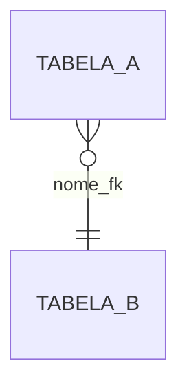

# Prompt: generate-erd-report

> Operação read-only. Apenas FKs reais no diagrama. Separe dados de inferências.

## Objetivo
Gerar diagrama ERD em formato Mermaid com as foreign keys reais do banco (pg_constraint),
para visualizar o modelo relacional.

## Entradas esperadas
- `schema` (opcional): restringir ao schema.
- `database` (opcional).
- `limit` (default 200).

## Passos de raciocínio
1. Execute `generate-erd-report` (usa `list_relationships` internamente).
2. Leia `relationships`.
3. Gere bloco mermaid `erDiagram` com as FKs encontradas.
4. Se 0 relacionamentos: declare "Sem FKs encontradas neste schema/banco."

## Regras de decisão
- Só inclua FKs reais (retornadas pelo runner). **NUNCA** invente seta no diagrama.
- Se o schema pedido não tiver FKs mas outros schemas tiverem, informe e ofereça
  executar sem filtro de schema.

## Saída

Seguido de tabela textual de relacionamentos (opicional, para referência).

## NÃO faça
- Não adicione seta heurística ao diagrama ERD.
- Não leia dados de linha.
