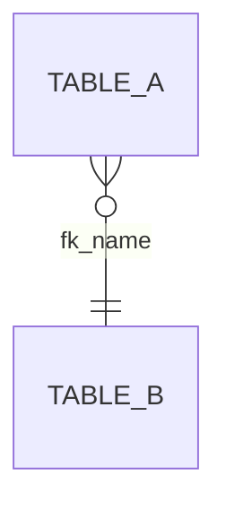

# Postgres ERD Report

- Database: <database>

```mermaid
erDiagram
  TABLE_A }o--|| TABLE_B : fk_name
```

<!-- Dados coletados: list_relationships() — FKs reais de pg_constraint. Sem FKs = diagrama vazio. -->
