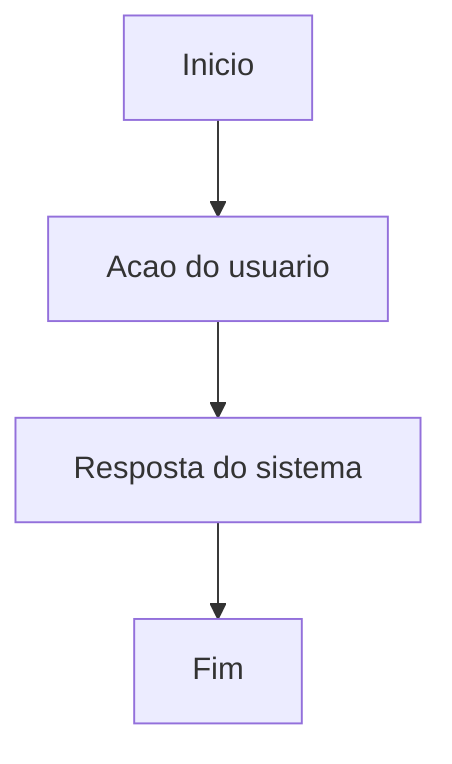

# Especificacao De Software

## Resumo Executivo

## Fatos Fornecidos

## Inferencias

## Premissas

## Contexto E Problema

## Objetivos

## Escopo

## Fora De Escopo

## Atores E Personas

## Requisitos Funcionais

## Requisitos Nao Funcionais

## Regras De Negocio

## User Stories

## Criterios De Aceite

## Jornadas E Fluxogramas

## Modelo De Dados

## APIs E Integracoes

## Permissoes E Seguranca

## Observabilidade

## Estrategia De Testes

## Riscos E Dependencias

## Matriz De Rastreabilidade

## Perguntas Abertas

## Handoff Para Desenvolvimento
