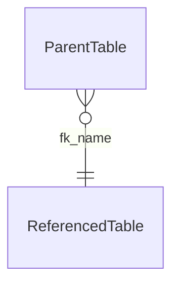

# SQL Server ERD Report

## Contrato de saída

Bloco mermaid `erDiagram` com relacionamentos FK declarados:



Nota: reflete apenas FKs com constraint declarada no banco. Cardinalidade
`}o--||` é genérica (FK). Não representa multiplicidade real verificada por dados.

Se não houver FKs: mensagem `EMPTY["No relationships detected"]`.

Formato JSON (para encadeamento):
```json
{
  "schema": "dbo",
  "count": 5,
  "relationships": [
    {
      "relationship_name": "FK_Orders_Customers",
      "parent_table": "dbo.Orders",
      "parent_column": "customer_id",
      "referenced_table": "dbo.Customers",
      "referenced_column": "id"
    }
  ]
}
```
